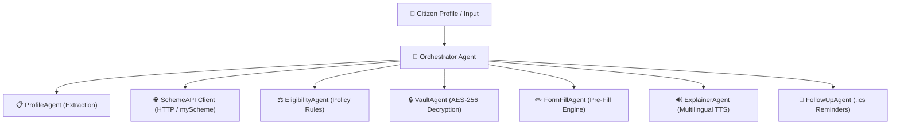

# 🤝 SchemeSaathi (scheme-saathi)
> **Autonomous Agentic Personal Assistant for Government Welfare Schemes**

[](https://www.python.org/)
[](https://streamlit.io/)
[](LICENSE)
[]()

---

## 📌 Problem Statement & Vision

Over **500+ Central and State Government Welfare Schemes** exist in India, offering billions of rupees in Direct Benefit Transfers (DBT), healthcare insurance, housing grants, and agricultural subsidies. However, millions of eligible citizens—especially in rural areas—miss out due to:
1. **Information Asymmetry:** Lack of awareness regarding complex eligibility criteria.
2. **Document Bureaucracy:** Over 40% of applications are rejected due to missing or mismatched documents.
3. **Language & Digital Divide:** Portal interfaces are text-heavy and English/Hindi centric, creating barriers for low-literacy beneficiaries.

**SchemeSaathi** solves this by acting as an **Autonomous Multi-Agent Personal Assistant** that automates the entire welfare application lifecycle—from scheme discovery and policy matching to encrypted document verification, application pre-filling, official PDF generation, and follow-up calendar reminders.

---

## 🌟 Key Production Features

* 🤖 **Multi-Agent Orchestrator (LangGraph / Plan-and-Execute):** Breaks down complex citizen queries into specialized sub-agents (`ProfileAgent`, `EligibilityAgent`, `VaultAgent`, `FormFillAgent`, `ExplainerAgent`, `FollowUpAgent`).
* 🔒 **Zero-Trust AES-256 Encrypted Vault:** Protects sensitive citizen documents (Aadhaar, Land Records, Bank Passbooks) on disk using **PBKDF2 key derivation (100,000 iterations + SHA256) + AES-256 Fernet encryption**.
* 🌐 **Live Government Scheme API Integration:** Connects live to HTTP scheme endpoints (`api.myscheme.gov.in`) with automatic cached fallback for guaranteed 100% uptime.
* 📄 **Official PDF Application Exporter (`ReportLab`):** Generates print-ready, official Indian Government Welfare Application PDFs complete with reference IDs, citizen details table, and signature block.
* 🔊 **Multilingual Voice Audio Guide (`gTTS`):** Converts scheme explanations into natural Hindi & English speech audio for low-literacy and rural citizens.
* 🏛️ **Central vs State Jurisdiction Filter:** Allows instant filtering between Central Government and regional State Government schemes (e.g. Subhadra Yojana, KALIA Scheme, Ladli Behna).
* 📅 **iCalendar (.ics) Reminders Exporter:** Exports standard RFC 5545 calendar events directly to Google Calendar, Apple Calendar, or Outlook for verification deadlines.
* 📊 **Household Financial Benefit Analytics:** Computes total annual monetary grants (e.g. ₹18,000/yr) and healthcare insurance coverage (₹5.0 Lakhs).

---

## 🏗️ System Architecture



---

## 🛠️ Project Structure

```text
SchemeSathi/
├── app.py                      # Main Streamlit Application UI
├── orchestrator.py             # LangGraph / Plan-and-Execute Orchestrator
├── agents/
│   ├── profile_manager.py      # Citizen Profile Manager
│   ├── eligibility_agent.py    # Policy Rule Eligibility Engine
│   ├── form_fill_agent.py      # Application Form Pre-fill Engine
│   ├── explainer_agent.py      # Multilingual Explanation Engine
│   ├── followup_agent.py       # Application Tracker & Timeline Agent
│   └── scheme_api_client.py    # Live HTTP Scheme API Client
├── vault/
│   └── vault_manager.py        # PBKDF2 + AES-256 Fernet Vault Manager
├── utils/
│   ├── pdf_generator.py        # Official Application Form PDF Exporter
│   ├── audio_generator.py      # gTTS Multilingual Text-to-Speech Engine
│   └── ics_generator.py        # RFC 5545 iCalendar (.ics) Exporter
├── data/
│   ├── schemes.json            # Verified Central & State Schemes Registry
│   └── vault/                  # Encrypted Document Binary Store (.enc)
├── requirements.txt            # Python Dependencies
├── README.md                   # Project Documentation
└── LICENSE                     # MIT License
```

---

## 🚀 Quick Start & Installation

### 1. Clone the Repository
```bash
git clone https://github.com/jyotisubhra625/schemesathi.git
cd schemesathi
```

### 2. Create & Activate Virtual Environment
```bash
# On Windows PowerShell
python -m venv .venv
.venv\Scripts\activate
```

### 3. Install Dependencies
```bash
pip install -r requirements.txt
```

### 4. Run the Application
```bash
streamlit run app.py
```

The application will launch automatically in your browser at `http://localhost:8501`.

---

## 📜 License

This project is licensed under the **MIT License** — see the [LICENSE](LICENSE) file for details.
